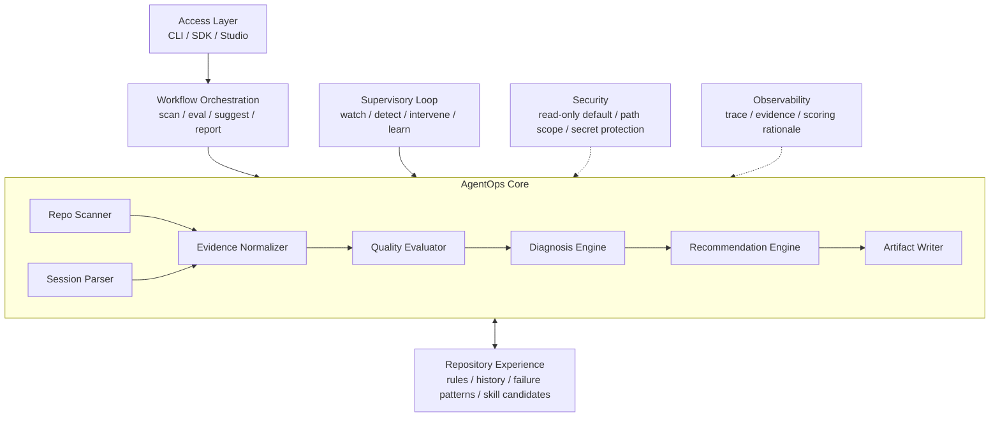

# AgentOps Harness

AgentOps Harness 是一个面向真实代码仓库的 AI coding 工作质量评测与优化系统。

Claude Code、Codex、Cursor 等工具负责执行开发任务。AgentOps Harness 负责观察和评估这些工具的工作过程，解释问题原因，并把一次开发中的经验沉淀为下一次可复用的仓库资产。

项目关注的不是“哪个 coding agent 更强”，而是：

- 当前 Agent 是否读取了正确上下文。
- 修改是否超出任务边界。
- 验证证据是否充分。
- 长对话是否开始退化。
- 哪些规则应该写进 `CLAUDE.md` 或 `AGENTS.md`。
- 哪些重复经验应该提炼为 skill、hook、测试命令或工作流建议。

## Status

项目处于早期开发阶段。当前已经完成 Phase 0：Python 包骨架、核心数据模型和最小 CLI。

| 能力 | 状态 |
| --- | --- |
| 核心数据模型 | 已完成 |
| 最小 CLI：`agentops --help`、`agentops --version` | 已完成 |
| 仓库 AI coding readiness 扫描 | 计划中 |
| 离线 Session Eval | 计划中 |
| 规则、skill、hook 建议生成 | 计划中 |
| 实时旁路 Watcher | 长期规划 |
| 团队级 AgentOps Studio | 长期规划 |

## Product Shape

AgentOps Harness 最终会成为运行在真实仓库旁边的 AgentOps 控制层。它不接管 coding agent，而是为 AI coding 提供质量基础设施。

```text
Before work:  Repo Scan -> Task Contract -> Context Suggestions
During work:  Observe -> Detect -> Decide -> Intervene -> Learn
After work:   Evaluate -> Diagnose -> Recommend -> Write Artifacts
```

第一阶段采用确定性 workflow，保证评测结果可复现、可解释、可测试：

```text
Repo Scan
-> Session Parse
-> Evidence Normalize
-> Quality Evaluate
-> Diagnose
-> Recommend
-> Artifact Write
```

实时能力成熟后，系统会加入监督型 Agent Loop：

```text
Observe -> Detect -> Decide -> Intervene -> Learn -> Observe
```

这个 loop 不负责写代码。它持续观察文件变化、git diff、命令输出、测试结果和会话日志，在任务偏离目标或上下文退化时提醒开发者。

## Architecture



核心原则：

```text
Workflow controls the process;
supervisory loop watches the process;
LLM enriches diagnosis and recommendations.
```

## Planned CLI

第一版 CLI 计划提供：

```bash
# 检查仓库是否适合 AI coding
agentops scan --repo <repo-path>

# 评估一次离线 AI coding 过程
agentops eval \
  --repo <repo-path> \
  --transcript <session.md> \
  --diff <changes.diff>

# 根据扫描和评测结果生成改进建议
agentops suggest --repo <repo-path>

# 输出或重新渲染报告
agentops report --repo <repo-path>
```

当前可用命令：

```bash
agentops --help
agentops --version
```

## Output Artifacts

第一版会逐步生成以下产物：

| 文件 | 用途 |
| --- | --- |
| `agentops-report.md` | 面向开发者的仓库 readiness 或会话评测报告 |
| `agentops-score.json` | 面向工具链的结构化评分和诊断证据 |
| `suggested-claude-md.md` | `CLAUDE.md` 改进草案 |
| `suggested-agents-md.md` | `AGENTS.md` 改进草案 |
| `skill-candidates.md` | 可以沉淀为 skill 的重复经验 |

默认情况下，本地运行产物写入 `.agentops/`，不会进入 Git。

## Roadmap

| 阶段 | 目标 | 主要产出 |
| --- | --- | --- |
| Phase 0 | 建立公共语言和工程骨架 | 核心模型、CLI、测试框架 |
| Phase 1 | 打通仓库扫描闭环 | `agentops scan`、Markdown 报告、JSON 评分 |
| Phase 2 | 建立确定性 workflow runtime | pipeline 状态、事件、错误降级、trace |
| Phase 3 | 扩展分析工具层 | git、diff、CI、test、transcript、shell output 解析 |
| Phase 4 | 评估单次 AI coding 过程 | `agentops eval`、上下文和边界诊断 |
| Phase 5 | 沉淀仓库级经验 | 历史评测、失败模式、规则和 skill 候选 |
| Phase 6 | 生成改进资产 | `CLAUDE.md`、`AGENTS.md`、hook 和工作流建议 |
| Phase 7 | 引入实时监督 | Watcher、监督型 loop、趋势分析、团队视图 |

## Development

要求 Python 3.11 或更高版本。

```bash
python -m pip install -e ".[dev]"
python -m pytest -v
agentops --help
```

项目按小步闭环推进。每个开发任务先写失败测试，再实现最小代码，测试通过后提交。不要一次铺开后续 Phase 的能力。

开始开发前，请阅读：

- [`agent.md`](agent.md)：后续 AI coding agent 的快速上下文。
- [`docs/positioning-and-boundaries.md`](docs/positioning-and-boundaries.md)：项目定位、边界和最终形态。
- [`docs/superpowers/plans/2026-05-30-phase-0-core-scaffold.md`](docs/superpowers/plans/2026-05-30-phase-0-core-scaffold.md)：Phase 0 实施计划。
- [`docs/superpowers/plans/2026-05-30-phase-1-minimal-repo-scan.md`](docs/superpowers/plans/2026-05-30-phase-1-minimal-repo-scan.md)：Phase 1 实施计划。

## Non-goals

- 不实现另一个完整 coding agent。
- 不替代 Claude Code、Codex 或 Cursor。
- 不做多 Agent 横向排行榜。
- 不把代码 review 当作唯一能力。
- 不让 LLM 掌控主流程。
- 不自动修改用户仓库，除非后续版本加入明确授权。

## License

License 尚未确定。在正式发布前补充。
