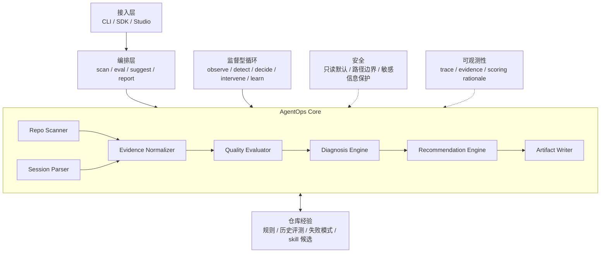

# AgentOps Harness 架构设计

## 设计目标

AgentOps Harness 负责评估和优化真实仓库中的 AI coding 工作质量。它不执行 coding agent 的任务，也不让 LLM 掌控主流程。

项目采用两阶段架构：

1. 第一阶段使用确定性 workflow 完成仓库扫描、离线会话解析、质量评估、诊断和建议生成。
2. 后续增加监督型 Agent Loop，持续观察 AI coding 过程，并在发现风险时向开发者发出建议或请求确认。

完整定位和项目边界见 `positioning-and-boundaries.md`。

## 总体架构



核心原则：

```text
Workflow controls the process;
supervisory loop watches the process;
LLM enriches diagnosis and recommendations.
```

## 分层职责

### 接入层

接入层负责接收用户请求并返回结果。它保持轻量，不包含评测规则。

第一版只提供 CLI：

```text
agentops scan --repo <repo-path>
agentops eval --repo <repo-path> [--session <session.md>] [--diff-base <ref>] [--output <dir>] [--intent-judge {deterministic,llm}] [--intent-model <id>] [--intent-base-url <url>]
agentops memory --repo <repo-path> [--history <eval-history.jsonl>] [--output <dir>]
```

后续可以增加 SDK 和 Studio。

### 编排层

编排层负责组织确定性 workflow。它只决定步骤顺序，不实现扫描、解析或评分细节。

仓库扫描流程：

```text
scan_repository -> evaluate_readiness -> write_readiness_artifacts
```

当前编排层通过 `WorkflowRunner` 顺序执行同步步骤，并将生命周期事件写入 `WorkflowTrace`。required step 失败时立即停止后续步骤并保留失败 trace；optional step 失败时记录可恢复失败，继续执行后续步骤，并以 `completed_with_warnings` 结束。

离线会话评测流程（Phase 4 已实现）：

```text
parse_session → select_task → collect_diff → reconcile_scope → judge_intent → build_eval_result → write_eval_artifacts
   (声明)         (最新任务)       (真相)         (确定性对账)     (意图裁决:LLM 接缝)    (评分/发现/建议)      (报告/评分/历史/trace)
```

`run_eval` 通过同一个 `WorkflowRunner` 编排上述步骤：取最新一条任务报告作为声明，采集相对可配置 base（默认 `HEAD`）的 git diff 作为真相，用确定性的 `reconcile_scope` 找出文件集合层的差值，把差值转成 `EvalResult` 的确定性 scope-discipline 评分、带证据的 `Finding` 和可执行 `Recommendation`，再把"差值是否落在任务意图之内"交给可注入的 `IntentJudge`。

LLM 只在 `judge_intent` 这一处介入。默认 `DeterministicIntentJudge` 对每个 `intent_alignment` 给出 `needs_review`（`source=deterministic`），整条默认路径无需 API key、无网络调用。Phase 4.5 在同一 `IntentJudge` 接口后填充了可选的 `LLMIntentJudge`（`--intent-judge llm`）：对每条确定性漂移发现逐条裁决 `within_intent` / `drift`（`source=llm`），任何失败都降级回确定性 `needs_review`。每次评测向 `--output` 写出 `agentops-report.md`、`agentops-score.json`、`agentops-trace.json`，并向 append-only 的 `eval-history.jsonl` 追加一行带时间戳的记录，供 Phase 5 趋势分析使用。

评测的核心不是"复述 agent 做了什么",而是"对账 agent 声称的和实际发生的"。agent 自述的 session md 是声明,git diff 和命令退出码是 agent 无法伪造的 ground truth,两者之间的差值才是诊断的核心信号。

### 意图裁决的 LLM 接缝（Phase 4.5）

确定性规则只能发现"文件集合/广度"层的差值（哪些路径未声明、改动横跨几个模块），无法判断这些差值是否属于任务意图——同样是 `undeclared_change`，`tests/test_auth.py` 往往是顺带的合理改动，`src/billing.py` 则可能是真正越界。Phase 4.5 在已就位的 `IntentJudge` 接缝后填充这一处语义判断，且严格遵守"确定性默认、LLM 可选、裁决不移动分数"的边界。

接缝形状（provider 无关）：

```text
agentops/llm/client.py            LLMClient 协议（文本进、文本出）+ LLMRequest / LLMResponse / LLMError
agentops/llm/openai_compatible.py OpenAICompatibleClient：唯一适配器，仅用标准库 urllib 调 OpenAI 兼容 /chat/completions
agentops/judges/llm_intent.py     LLMIntentJudge：选发现 → 拼提示 → 调用 → 解析/校验 → 映射；任何失败降级
```

设计要点：

- **provider 无关**：`LLMClient` 是文本进、文本出的最薄协议；结构化输出（严格 JSON 的解析与校验）是 judge 的职责，于是"响应无法解析"退化为一次安全降级而不是崩溃。
- **零新增依赖**：唯一适配器 `OpenAICompatibleClient` 只用标准库 `urllib`，适配任何 OpenAI 兼容网关（默认指向 mimo `mimo-v2.5-pro`，可经 `--intent-base-url` / `AGENTOPS_LLM_BASE_URL` 覆盖）。`import agentops` 永远不需要第三方 SDK。模型 id 由 `--intent-model` 提供，库代码不硬编码任何模型层级。
- **逐条裁决**：`LLMIntentJudge` 只把 `undeclared_change` 和 `cross_module_breadth` 交给模型逐条裁决（`within_intent` / `drift`），并把模型回复严格解析、校验取值与覆盖完整性后映射为 `IntentVerdict(source="llm")`。推理型模型会把"思考"算进 token 上限，故请求时预留充裕的 `max_tokens`。
- **任何失败降级**：缺 SDK/缺 key/缺 model/网络错误/响应不可解析/取值非法/覆盖不全——一律委托 `DeterministicIntentJudge` 返回 `needs_review`（`source="deterministic"`），`judge()` 绝不因模型侧问题向上抛异常。受限/离线环境下行为与默认路径完全一致。
- **裁决不移动分数**：`build_eval_result` 仍只用确定性 `evaluate_scope` 计算 scope-discipline 分数；`intent_verdicts` 只是并列记录的富化信息。一次降级运行与默认运行同分。是否让累积的 `drift` 裁决反过来校准分数，留到 Phase 5 用数据决定。
- **产物富化**：报告把裁决按 `drift` / `within_intent` / `needs_review` 分组并标注来源；`eval-history.jsonl` 行追加按裁决/来源的计数摘要（`verdict_summary`），供 Phase 5 读取 drift 趋势。仅确定性裁决时报告保持 Phase 4 的扁平形态。

### 仓库记忆的确定性投影（Phase 5）

确定性评测每次向 append-only 的 `eval-history.jsonl` 追加一行。Phase 5 增加一条**只读**的记忆流水线，把累积的历史确定性地投影为仓库记忆，与 scan/eval 共用同一个 `WorkflowRunner`，不改动 eval 流水线分毫：

```text
agentops memory --repo <path>
  read_history             eval-history.jsonl  → tuple[HistoryRecord, ...]   （跳过空行/坏行/旧行容错）
  → build_repo_memory      （确定性投影；叙述者默认身份实现）
       ├─ compute_score_trend      分数 + 漂移随时间 → ScoreTrend
       ├─ mine_failure_modes       按稳定 code 聚类 findings + drift 裁决 → FailureMode[]
       ├─ derive_rule_candidates   反复模式 → Recommendation[]（N/M 证据；复用 RecommendationKind）
       ├─ derive_skill_candidates  反复模式 + 热点路径 → SkillCandidate[]
       └─ MemoryNarrator.narrate   （确定性默认：原样返回投影）
  → write_memory_artifacts  agentops-memory.md、agentops-memory.json、skill-candidates.md、agentops-trace.json
```

记忆蒸馏四样东西：分数/漂移**趋势**、反复出现的**失败模式**（按稳定 code 聚类，各带「N/M 次评测复现」证据、热点路径与最近出现时间）、带证据的**规则候选**（复用现有 `Recommendation`，不新增模型）、可复用的 **skill 候选**。设计边界：

- **记忆是投影，不是新存储**：记忆产物每次从 `eval-history.jsonl` 重新生成并覆盖写出，历史仍是唯一真相来源；不引入第二个 append-only 日志。同样的历史产出字节一致的记忆。
- **确定性投影，接缝先就位**：所有蒸馏都是确定性的（计数、走向、按稳定 code 聚类、按频次排序）。`MemoryNarrator` 接缝已就位但本阶段只有确定性身份实现（与 Phase 4 先就位 `IntentJudge` 同构）；可选的 LLM 叙述者留到 Phase 5.5，且**只能改写描述字段**（summary / rationale / title），绝不改动结构事实（code / 计数 / 路径），与 LLM 意图判官「绝不重新推导文件集合」同构。
- **裁决不移动分数**：记忆只**读取** `result.score` 计算趋势、读取 `verdict_summary` 报告 drift 走向，从不重算、扣减或写回任何评测分数。是否让 drift 趋势校准分数仍留待累积数据justify。
- **只读、离线、零新增依赖**：`agentops memory` 对目标仓库只读（仅向 `--output` 写产物），不调用任何 LLM、不触网、不需 key；缺失/空历史以结构化 `MemoryWorkflowError` 退出（退出码 1，提示先跑 `agentops eval`，无 traceback）。`agentops eval` 不会自动刷新记忆，二者解耦。

### 证据分层

| 证据类型 | 来源 | agent 能否伪造 | 用途 |
| --- | --- | --- | --- |
| `TaskReport` | agent 自写 | 能 | 声明:agent 声称做了什么 |
| `DiffSummary` | git diff | 不能 | 真相:实际改了什么 |
| `ShellResult` | 命令执行 | 不能 | 真相:命令是否成功 |
| `TestResult` | 测试框架输出 | 不能 | 真相:测试是否通过 |
| `GitStatus` | git status | 不能 | 真相:当前仓库状态 |

评估逻辑:拿 agent 不可控的真相去校验 agent 声称的声明。差值越大,诊断信号越强。

### 核心层

| 模块 | 职责 | 第一版状态 |
| --- | --- | --- |
| `core/` | 定义稳定的领域模型和序列化契约 | 已建立基础模型 |
| `scanners/` | 只读扫描仓库结构、约束文件、CI 和测试线索 | Phase 1 已实现；Phase 3 增加 CI 验证命令提取 |
| `parsers/` | 解析 transcript、diff、shell output、测试结果、累积 eval 历史 | Phase 3 已实现 diff、shell output、transcript 解析；Phase 4 解析可选 `### Changed Files`；Phase 5 增加容错的 `eval-history.jsonl` 读取器 |
| `analyzers/` | 通过受控只读 Git 子进程采集 branch、status 和规范化 diff | Phase 3 已实现 GitAnalyzer；Phase 4 支持可配置 diff base |
| `initializers/` | 显式安装 session protocol、托管指令块和 session log 策略 | Phase 3 已实现 |
| `evaluators/` | 使用确定性规则生成评分和 Finding | Phase 1 readiness 规则；Phase 3.5 scope-drift 对账；Phase 4 确定性 session-eval 评分 |
| `judges/` | 意图裁决可注入接口、确定性默认判官与可选 LLM 判官（唯一 LLM 接缝） | Phase 4 确定性默认判官；Phase 4.5 增加可选 `LLMIntentJudge`（任何失败降级到确定性） |
| `llm/` | provider 无关的 `LLMClient` 接缝与唯一的 OpenAI 兼容适配器（仅标准库） | Phase 4.5 已实现；零新增依赖 |
| `memory/` | 把累积 eval 历史确定性地投影为趋势/失败模式/规则候选/skill 候选，并在叙述接缝后装配 | Phase 5 已实现；确定性默认、不移动分数、零新增依赖 |
| `recommenders/` | 诊断 Finding 并输出优化指引,不直接生成最终文本 | 后续扩展 |
| `writers/` | 输出 Markdown、JSON 和建议草案 | Phase 2 readiness 与 workflow trace 产物；Phase 4 eval 报告/评分/历史产物；Phase 5 记忆报告/JSON/skill 候选产物 |
| `runtime/` | 串联各模块，维护 workflow 状态和事件 | Phase 2 scan workflow 编排、错误隔离和 trace；Phase 4 session-eval workflow；Phase 5 记忆投影 workflow |

## 核心数据模型

当前已实现：

| 模型 | 用途 |
| --- | --- |
| `RepoProfile` | 保存只读仓库扫描结果（含 CI 验证命令） |
| `Finding` | 保存带证据的诊断发现 |
| `ReadinessReport` | 聚合仓库画像、评分、发现和建议 |
| `Recommendation` | 保存可执行改进建议 |
| `Artifact` | 描述生成的报告或结构化产物 |
| `WorkflowTrace` | 保存 workflow 状态、生命周期事件和步骤失败 |
| `DiffSummary` / `ChangedFile` | 保存规范化的 git diff 证据 |
| `GitStatus` | 保存只读 git 状态采集结果 |
| `CIProfile` | 保存 CI 配置文件和保守提取的验证命令 |
| `ShellResult` / `TestResult` | 保存有界 shell 输出摘要和受支持的测试结果 |
| `SessionTrace` / `TaskReport` / `VerificationRecord` | 保存有界任务日志的规范化证据 |
| `EvalResult` / `IntentVerdict` | 保存单次会话评测结果与意图裁决（intent_alignment 的 LLM 接缝载体） |
| `HistoryRecord` | 保存 `eval-history.jsonl` 一行经解析后的结构化记录（容错、有界） |
| `ScoreTrend` / `FailureMode` / `SkillCandidate` / `RepoMemory` | 保存 eval 历史的确定性记忆投影：趋势、失败模式、skill 候选与聚合记忆 |

后续按真实需求增加：

| 模型 | 用途 |
| --- | --- |
| `Intervention` | 保存实时监督循环给出的干预建议 |

不要提前增加未被实际 workflow 使用的模型。

Phase 3 分析工具的边界是“只采集和解析，不评分”：`agentops init` 是显式写操作；`TranscriptParser` 只读取有界的 `.agentops/agentops-session.md`，绝不展开 Evidence References 指向的原始 transcript；评分、诊断和建议留到 Phase 3.5 及之后。

## 第一条纵向切片

第一条可运行能力是：

```text
agentops scan --repo <repo-path>
```

它只读扫描目标仓库，识别：

- README。
- `AGENTS.md` 和 `CLAUDE.md`。
- 常见测试目录。
- 常见 CI 文件。
- 项目标记文件。
- 可以保守推断的测试命令。

然后输出：

```text
.agentops/
  agentops-report.md
  agentops-score.json
  agentops-trace.json
```

其中 `agentops-trace.json` 记录 workflow 步骤顺序、最终状态和失败信息。成功扫描和可写输出目录下的失败扫描都会保留 trace 证据。

## 建议引擎设计

建议引擎的核心原则:AgentOps 负责诊断,不负责执行改写。

### CLAUDE.md 优化:加法与减法

`CLAUDE.md` 每轮对话都会注入上下文,内容过多会挤占有效 token。优化必须同时做两件事:

- **加法**:补充缺失的约束、验证命令、边界说明。
- **减法**:移除教程性内容、冗余说明、应该放在 README 里的项目介绍。目标是保持在 200 行以内。

建议引擎输出的是诊断结果（"缺什么""多什么""哪些该精简"）,不是最终文本。

### Skill 渐进式披露

优化指南以 skill 形式存在,包含:

- `CLAUDE.md` 应该包含什么（项目约束、验证命令、边界、常见坑）。
- `CLAUDE.md` 不应该包含什么（教程、冗余说明、通用最佳实践）。
- 精简原则（每条规则不超过一行、用具体命令代替抽象描述）。

这些指南通过渐进式披露按需加载:只在 agent 执行 `CLAUDE.md` 优化任务时注入上下文,日常 coding 时不加载。这避免了优化指南本身成为上下文污染。

### 数据累积

每次 eval 完成后,诊断结果追加到 `.agentops/eval-history.jsonl`。不实现完整的记忆系统,只是把数据先存下来。这样:

- Phase 4 的 eval 本身就产出历史数据。
- Phase 5 的记忆系统（`agentops memory`）从这些历史数据中读取并确定性地投影出趋势、失败模式、规则候选和 skill 候选，而不是从零开始。
- 用户从 Phase 4 开始就能看到"这个仓库的问题在恶化还是在改善"的趋势。

## 架构约束

- 默认只读。扫描目标仓库时不写入目标目录。
- 先做确定性规则，再引入 LLM 辅助。
- 每次扣分必须附带证据和可执行建议。
- 接入层保持轻量，领域逻辑留在核心模块。
- 公共模型负责稳定序列化，writer 不猜测内部类型。
- 每个模块有单一职责，并可以独立测试。
- 监督型 Agent Loop 在离线 workflow 稳定后再实现。
