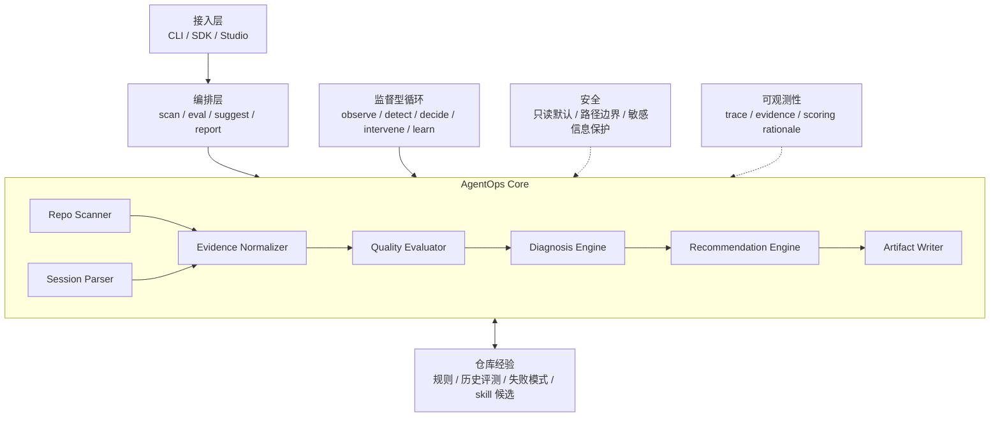

# AgentOps Harness 架构设计

## 设计目标

AgentOps Harness 负责评估和优化真实仓库中的 AI coding 工作质量。它不执行 coding agent 的任务，也不让 LLM 掌控主流程。

项目采用两阶段架构：

1. 第一阶段使用确定性 workflow 完成仓库扫描、离线会话解析、质量评估、诊断和建议生成。
2. 后续增加监督型 Agent Loop，持续观察 AI coding 过程，并在发现风险时向开发者发出建议或请求确认。

完整定位和项目边界见 `positioning-and-boundaries.md`。

## 总体架构



核心原则：

```text
Workflow controls the process;
supervisory loop watches the process;
LLM enriches diagnosis and recommendations.
```

## 分层职责

### 接入层

接入层负责接收用户请求并返回结果。它保持轻量，不包含评测规则。

第一版只提供 CLI：

```text
agentops scan --repo <repo-path>
agentops eval --repo <repo-path> --transcript <session.md> --diff <changes.diff>
```

后续可以增加 SDK 和 Studio。

### 编排层

编排层负责组织确定性 workflow。它只决定步骤顺序，不实现扫描、解析或评分细节。

仓库扫描流程：

```text
scan_repository -> evaluate_readiness -> write_readiness_artifacts
```

当前编排层通过 `WorkflowRunner` 顺序执行同步步骤，并将生命周期事件写入 `WorkflowTrace`。required step 失败时立即停止后续步骤并保留失败 trace；optional step 失败时记录可恢复失败，继续执行后续步骤，并以 `completed_with_warnings` 结束。

离线会话评测流程：

```text
TaskReport (agent 声明) ──┐
                          ├── Reconcile ── Evaluate ── Diagnose ── Recommend ── Artifact Write
DiffSummary + ExitCode ──┘   (对账)
```

评测的核心不是"复述 agent 做了什么",而是"对账 agent 声称的和实际发生的"。agent 自述的 session md 是声明,git diff 和命令退出码是 agent 无法伪造的 ground truth,两者之间的差值才是诊断的核心信号。

### 证据分层

| 证据类型 | 来源 | agent 能否伪造 | 用途 |
| --- | --- | --- | --- |
| `TaskReport` | agent 自写 | 能 | 声明:agent 声称做了什么 |
| `DiffSummary` | git diff | 不能 | 真相:实际改了什么 |
| `ShellResult` | 命令执行 | 不能 | 真相:命令是否成功 |
| `TestResult` | 测试框架输出 | 不能 | 真相:测试是否通过 |
| `GitStatus` | git status | 不能 | 真相:当前仓库状态 |

评估逻辑:拿 agent 不可控的真相去校验 agent 声称的声明。差值越大,诊断信号越强。

### 核心层

| 模块 | 职责 | 第一版状态 |
| --- | --- | --- |
| `core/` | 定义稳定的领域模型和序列化契约 | 已建立基础模型 |
| `scanners/` | 只读扫描仓库结构、约束文件、CI 和测试线索 | Phase 1 已实现 |
| `parsers/` | 解析 transcript、diff、shell output、测试结果 | 后续实现 |
| `evaluators/` | 使用确定性规则生成评分和 Finding | Phase 1 已实现 readiness 规则 |
| `recommenders/` | 诊断 Finding 并输出优化指引,不直接生成最终文本 | 后续扩展 |
| `writers/` | 输出 Markdown、JSON 和建议草案 | Phase 2 已实现 readiness 与 workflow trace 产物 |
| `runtime/` | 串联各模块，维护 workflow 状态和事件 | Phase 2 已实现 scan workflow 编排、错误隔离和 trace |

## 核心数据模型

当前已实现：

| 模型 | 用途 |
| --- | --- |
| `RepoProfile` | 保存只读仓库扫描结果 |
| `Finding` | 保存带证据的诊断发现 |
| `ReadinessReport` | 聚合仓库画像、评分、发现和建议 |
| `Recommendation` | 保存可执行改进建议 |
| `Artifact` | 描述生成的报告或结构化产物 |
| `WorkflowTrace` | 保存 workflow 状态、生命周期事件和步骤失败 |

后续按真实需求增加：

| 模型 | 用途 |
| --- | --- |
| `SessionTrace` | 保存一次 AI coding 会话的规范化过程 |
| `WorkEvidence` | 保存 diff、命令、测试和上下文证据 |
| `EvalResult` | 保存单次工作过程的多维评测结果 |
| `Intervention` | 保存实时监督循环给出的干预建议 |

不要提前增加未被实际 workflow 使用的模型。

## 第一条纵向切片

第一条可运行能力是：

```text
agentops scan --repo <repo-path>
```

它只读扫描目标仓库，识别：

- README。
- `AGENTS.md` 和 `CLAUDE.md`。
- 常见测试目录。
- 常见 CI 文件。
- 项目标记文件。
- 可以保守推断的测试命令。

然后输出：

```text
.agentops/
  agentops-report.md
  agentops-score.json
  agentops-trace.json
```

其中 `agentops-trace.json` 记录 workflow 步骤顺序、最终状态和失败信息。成功扫描和可写输出目录下的失败扫描都会保留 trace 证据。

## 建议引擎设计

建议引擎的核心原则:AgentOps 负责诊断,不负责执行改写。

### CLAUDE.md 优化:加法与减法

`CLAUDE.md` 每轮对话都会注入上下文,内容过多会挤占有效 token。优化必须同时做两件事:

- **加法**:补充缺失的约束、验证命令、边界说明。
- **减法**:移除教程性内容、冗余说明、应该放在 README 里的项目介绍。目标是保持在 200 行以内。

建议引擎输出的是诊断结果（"缺什么""多什么""哪些该精简"）,不是最终文本。

### Skill 渐进式披露

优化指南以 skill 形式存在,包含:

- `CLAUDE.md` 应该包含什么（项目约束、验证命令、边界、常见坑）。
- `CLAUDE.md` 不应该包含什么（教程、冗余说明、通用最佳实践）。
- 精简原则（每条规则不超过一行、用具体命令代替抽象描述）。

这些指南通过渐进式披露按需加载:只在 agent 执行 `CLAUDE.md` 优化任务时注入上下文,日常 coding 时不加载。这避免了优化指南本身成为上下文污染。

### 数据累积

每次 eval 完成后,诊断结果追加到 `.agentops/eval-history.jsonl`。不实现完整的记忆系统,只是把数据先存下来。这样:

- Phase 4 的 eval 本身就产出历史数据。
- Phase 5 的记忆系统可以从这些历史数据中读取,而不是从零开始。
- 用户从 Phase 4 开始就能看到"这个仓库的问题在恶化还是在改善"的趋势。

## 架构约束

- 默认只读。扫描目标仓库时不写入目标目录。
- 先做确定性规则，再引入 LLM 辅助。
- 每次扣分必须附带证据和可执行建议。
- 接入层保持轻量，领域逻辑留在核心模块。
- 公共模型负责稳定序列化，writer 不猜测内部类型。
- 每个模块有单一职责，并可以独立测试。
- 监督型 Agent Loop 在离线 workflow 稳定后再实现。
