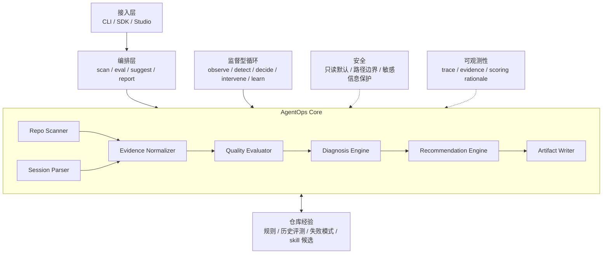

# AgentOps Harness 架构设计

## 设计目标

AgentOps Harness 负责评估和优化真实仓库中的 AI coding 工作质量。它不执行 coding agent 的任务，也不让 LLM 掌控主流程。

项目采用两阶段架构：

1. 第一阶段使用确定性 workflow 完成仓库扫描、离线会话解析、质量评估、诊断和建议生成。
2. 后续增加监督型 Agent Loop，持续观察 AI coding 过程，并在发现风险时向开发者发出建议或请求确认。

完整定位和项目边界见 `positioning-and-boundaries.md`。

## 总体架构



核心原则：

```text
Workflow controls the process;
supervisory loop watches the process;
LLM enriches diagnosis and recommendations.
```

## 分层职责

### 接入层

接入层负责接收用户请求并返回结果。它保持轻量，不包含评测规则。

第一版只提供 CLI：

```text
agentops scan --repo <repo-path>
agentops eval --repo <repo-path> --transcript <session.md> --diff <changes.diff>
```

后续可以增加 SDK 和 Studio。

### 编排层

编排层负责组织确定性 workflow。它只决定步骤顺序，不实现扫描、解析或评分细节。

仓库扫描流程：

```text
Repo Scan -> Readiness Evaluate -> Artifact Write
```

离线会话评测流程：

```text
Repo Scan
-> Session Parse
-> Evidence Normalize
-> Quality Evaluate
-> Diagnose
-> Recommend
-> Artifact Write
```

### 核心层

| 模块 | 职责 | 第一版状态 |
| --- | --- | --- |
| `core/` | 定义稳定的领域模型和序列化契约 | 已建立基础模型 |
| `scanners/` | 只读扫描仓库结构、约束文件、CI 和测试线索 | 待实现 |
| `parsers/` | 解析 transcript、diff、shell output、测试结果 | 后续实现 |
| `evaluators/` | 使用确定性规则生成评分和 Finding | 待实现 |
| `recommenders/` | 根据 Finding 生成可执行建议 | 后续扩展 |
| `writers/` | 输出 Markdown、JSON 和建议草案 | 待实现 |
| `runtime/` | 串联各模块，维护 workflow 状态和事件 | 待实现 |

## 核心数据模型

当前已实现：

| 模型 | 用途 |
| --- | --- |
| `RepoProfile` | 保存只读仓库扫描结果 |
| `Finding` | 保存带证据的诊断发现 |
| `ReadinessReport` | 聚合仓库画像、评分、发现和建议 |
| `Recommendation` | 保存可执行改进建议 |
| `Artifact` | 描述生成的报告或结构化产物 |

后续按真实需求增加：

| 模型 | 用途 |
| --- | --- |
| `SessionTrace` | 保存一次 AI coding 会话的规范化过程 |
| `WorkEvidence` | 保存 diff、命令、测试和上下文证据 |
| `EvalResult` | 保存单次工作过程的多维评测结果 |
| `Intervention` | 保存实时监督循环给出的干预建议 |

不要提前增加未被实际 workflow 使用的模型。

## 第一条纵向切片

第一条可运行能力是：

```text
agentops scan --repo <repo-path>
```

它只读扫描目标仓库，识别：

- README。
- `AGENTS.md` 和 `CLAUDE.md`。
- 常见测试目录。
- 常见 CI 文件。
- 项目标记文件。
- 可以保守推断的测试命令。

然后输出：

```text
.agentops/
  agentops-report.md
  agentops-score.json
```

## 架构约束

- 默认只读。扫描目标仓库时不写入目标目录。
- 先做确定性规则，再引入 LLM 辅助。
- 每次扣分必须附带证据和可执行建议。
- 接入层保持轻量，领域逻辑留在核心模块。
- 公共模型负责稳定序列化，writer 不猜测内部类型。
- 每个模块有单一职责，并可以独立测试。
- 监督型 Agent Loop 在离线 workflow 稳定后再实现。

