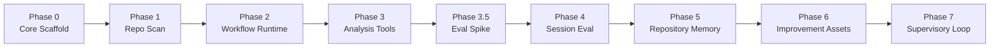

# AgentOps Harness 开发路线与并行协作

## 推进原则

项目按模块规划，按纵向能力切片实现，按小任务交给 AI coding agent。

不要逐文件机械开发，也不要一次铺开完整子系统。每个 milestone 都必须形成可以运行、测试和解释的闭环。

推荐粒度：

- 一个 milestone 交付一个用户可见能力。
- 一个 AI coding task 修改 1 到 3 个实现文件和对应测试。
- 每个 task 先写失败测试，再实现最小代码。
- 每个 task 完成后运行相关测试。
- 每个 milestone 完成后运行完整测试，并更新 `project-memory.md`。

### 纵向探针（spike）

当架构里存在未验证的关键假设时（例如"确定性规则在会话质量评估上是否够用"），不要等顺序推进到那个阶段才发现。用一条最薄的端到端切片提前打穿，目的不是交付功能，而是验证假设、暴露天花板。

探针和正常 feature 切片的区别：

- **目的**:验证假设，不是交付功能。
- **范围**:只切一个维度，打穿所有层。
- **质量**:可以硬编码、可以走捷径、验证完可以扔。
- **产出**:不是代码，是答案——"确定性规则能走多远""LLM 从哪里开始是必需的""数据模型信号够不够"。

探针完成后,基于答案决定下一阶段的架构,而不是凭假设设计。

## 总路线



| 阶段 | 目标 | 用户可见产出 | 状态 |
| --- | --- | --- | --- |
| Phase 0 | 建立公共语言和工程骨架 | `agentops --help`、`agentops --version` | 已完成 |
| Phase 1 | 打通仓库 readiness 扫描 | `agentops scan --repo <path>` | 已完成 |
| Phase 2 | 显式建模确定性 workflow | pipeline 状态、事件、错误降级、trace | 已完成 |
| Phase 3 | 扩展分析工具层 | `agentops init`、git、diff、CI、test、任务日志、shell output 解析 | 已完成 |
| Phase 3.5 | 验证会话评测假设（纵向探针） | 一个维度的 scope drift 评估，验证确定性规则天花板和声明对账机制 | 已完成 |
| Phase 4 | 评估单次 AI coding 过程 | `agentops eval`、上下文和边界诊断、`eval-history.jsonl` 数据累积 | 待规划 |
| Phase 5 | 沉淀仓库级经验 | 历史评测、失败模式、规则、skill 候选 | 待规划 |
| Phase 6 | 生成改进资产 | `CLAUDE.md`、`AGENTS.md`、hook 和流程建议 | 待规划 |
| Phase 7 | 加入实时监督 | Watcher、监督型 loop、趋势分析 | 待规划 |

## 当前执行计划

详细步骤保存在：

```text
docs/superpowers/plans/
```

当前顺序：

1. `2026-05-30-phase-0-core-scaffold.md`：已完成。
2. `2026-05-30-phase-1-minimal-repo-scan.md`：已完成。
3. `2026-05-31-phase-2-workflow-runtime.md`：已完成。
4. `2026-05-31-phase-3-analysis-tools.md`：已完成。

下一步：基于 Phase 3.5 探针结论（`docs/superpowers/findings/2026-06-03-scope-drift-spike.md`）规划 Phase 4 会话评测，先写实施计划再编码。

Phase 3 完成后,进入 Phase 3.5 纵向探针:用现有的 `TaskReport` + `DiffSummary`,实现一个维度的会话评估（scope drift）,纯确定性规则,标出"这里该插 LLM"的位置。探针同时验证两个假设：确定性规则在会话质量上能走多远；"agent 声明 vs diff 真相"对账机制是否跑得通。探针完成后,基于答案规划 Phase 4 架构。

hook 集成优先级提前:整个评估链依赖 agent 按协议写 session md。没有 hook 保障,agent 可以不写声明,对账链就断。在 Phase 3.5 探针之前,先实现最小 hook——agent 停止时检查 `agentops-session.md` 是否有新追加内容,没有则输出提醒。这是声明链路的可靠性基础。

每进入一个新阶段，先写一份新的纵向切片实施计划，再开始编码。

## Git Worktree 约定

并行开发使用项目本地目录：

```text
.worktrees/
```

该目录已加入 `.gitignore`。创建 worktree 前仍需验证忽略规则：

```powershell
git check-ignore .worktrees
```

分支使用：

```text
codex/<scope>
```

例如：

```text
codex/repo-scanner
codex/readiness-evaluator
codex/report-writer
```

创建 worktree：

```powershell
git worktree add ".worktrees/<scope>" -b "codex/<scope>"
```

进入 worktree 后先执行：

```powershell
python -m pip install -e ".[dev]"
python -m pytest -v
```

只有基线测试通过后，才开始功能开发。

## 哪些任务可以并行

并行的前提是：接口已经确定，写入文件没有重叠，任务可以独立测试。

### Phase 1：Repo Scan

先串行完成：

1. 扩展 `RepoProfile`，增加 `test_commands`。

接口稳定后可以并行：

| Worktree | 负责文件 | 任务 |
| --- | --- | --- |
| `codex/repo-scanner` | `agentops/scanners/`、`tests/test_repo_scanner.py` | 只读仓库扫描 |
| `codex/readiness-evaluator` | `agentops/evaluators/`、`tests/test_readiness_evaluator.py` | 透明评分规则和建议 |
| `codex/report-writer` | `agentops/writers/`、`tests/test_report_writer.py` | Markdown 和 JSON 输出 |

最后串行集成：

| Worktree | 负责文件 | 任务 |
| --- | --- | --- |
| `codex/scan-runtime` | `agentops/runtime/`、`tests/test_scan_runtime.py` | 串联 scanner、evaluator、writer |
| `codex/scan-cli` | `agentops/cli.py`、`tests/test_cli.py` | 暴露 `agentops scan` |

### Phase 2：Workflow Runtime

Phase 2 依赖链较强，默认串行执行：

```text
workflow models
-> workflow runner
-> trace writer
-> scan integration
-> CLI integration
-> docs
```

workflow models、workflow runner、trace writer、scan integration 和 CLI integration 均已完成。

完成 workflow models 后，可以有限并行：

| Worktree | 负责文件 | 任务 |
| --- | --- | --- |
| `codex/workflow-runner` | `agentops/runtime/workflow.py`、`tests/test_workflow_runtime.py` | 确定性 workflow runner |
| `codex/trace-writer` | `agentops/core/artifact.py`、`agentops/writers/trace.py`、`tests/test_trace_writer.py` | JSON trace 产物 |

scan runtime 和 CLI 集成继续串行处理，避免共享编排行为发生冲突。

### Phase 3：Analysis Tools

Phase 3 先串行完成公共证据模型、任务日志模型、仓库初始化和 CLI：

```text
evidence models
-> session models
-> repository initializer
-> init CLI
```

仓库初始化通过显式命令执行：

```powershell
agentops init --repo <repo-path>
```

它写入 `.agentops/session-protocol.md` 和 `.agentops/agentops-session.md`，并向已有 `CLAUDE.md`、`AGENTS.md` 追加托管协议块；两者都不存在时创建 `rule.md`。会话日志默认保持本地私有，用户也可以在 CLI 中选择跟踪或自行管理。

以下 parser 可以在接口确定后并行开发：

| Worktree | 任务 |
| --- | --- |
| `codex/diff-parser` | 解析 git diff |
| `codex/transcript-parser` | 解析有界的 `agentops-session.md` 任务日志 |
| `codex/shell-output-parser` | 解析命令输出和失败信息 |
| `codex/ci-detector` | 扩展 CI 和验证命令识别 |

git analyzer 依赖 diff parser，完成 diff 接口后再串行接入。Phase 3 不读取完整聊天记录，不调用 LLM，也不提前实现 `agentops eval`。

### Phase 4 之后

以下任务通常可以并行：

- fixture 仓库和 golden report。
- 新增独立评测规则。
- Writer 模板。
- 文档和示例。
- 存储适配器。

以下文件容易冲突，应尽量由集成任务统一修改：

- `agentops/cli.py`
- `agentops/core/__init__.py`
- `README.md`
- `docs/project-memory.md`
- `pyproject.toml`

## 集成规则

1. 功能 worktree 只修改分配给它的文件。
2. 功能分支提交前运行相关测试。
3. 合并到 `main` 前运行完整测试。
4. 合并后更新 `docs/project-memory.md`。
5. 删除已合并 worktree。
6. 只有 `main` 通过完整测试后才推送远程。

并行 worktree 不要同时修改 `docs/project-memory.md`。集中记忆由集成者在合并后更新，避免冲突和事实分叉。
